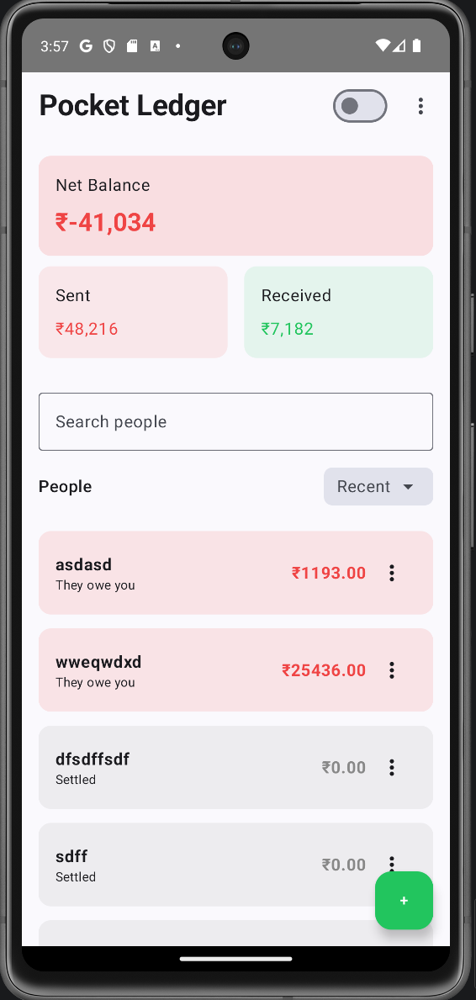
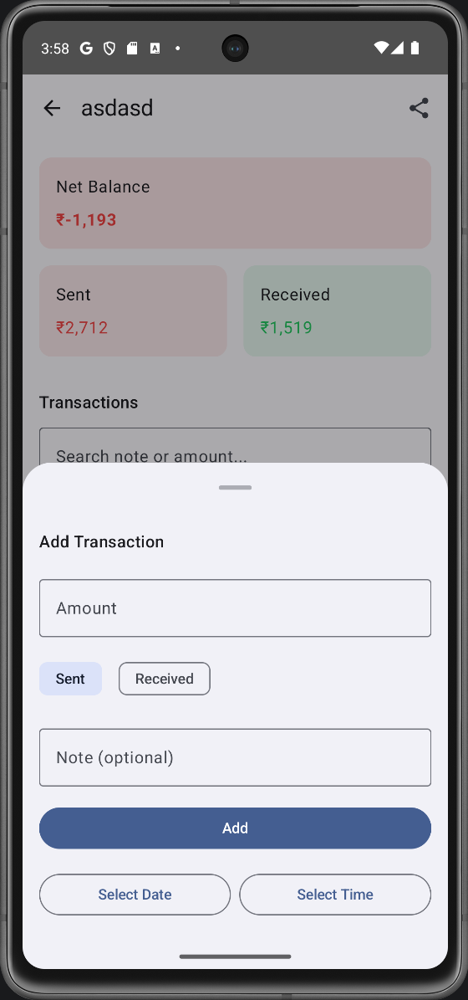
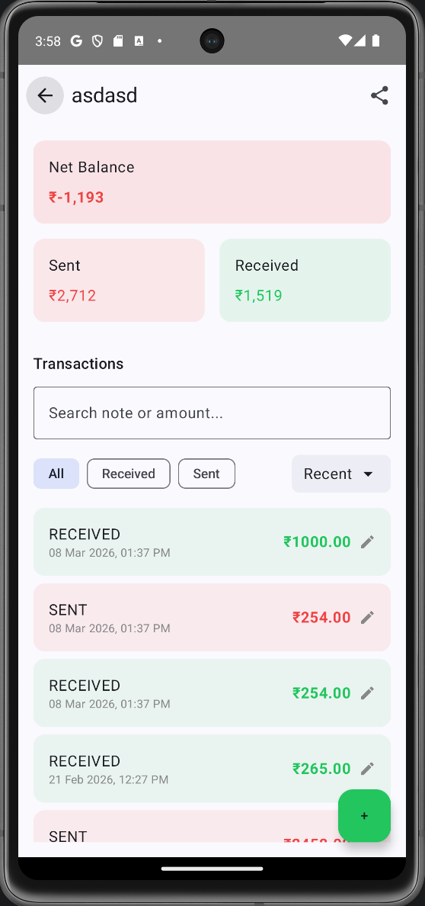

# PocketLedger


PocketLedger is a simple and lightweight Android application for tracking shared expenses between people.
It helps you record transactions, manage balances, and easily track who owes whom.

The app is designed with a **minimal interface and offline-first approach**, making it fast, simple, and reliable.

---

## Features

• Add and manage people involved in shared expenses
• Record transactions between users
• Automatic balance calculation
• Archive inactive people
• Clean and minimal UI
• Works fully offline
• Export expense reports
---

## Screenshots

## Screenshots

### Home Screen


### Add Transaction


### Person Account View


## Tech Stack

**Language**

* Kotlin

**Architecture**

* MVVM (Model View ViewModel)

**Android Components**

* Jetpack ViewModel
* LiveData / Flow
* Room Database
* Coroutines

**UI**

* Material Design Components

---

---

## Getting Started

Clone the repository

```bash
git clone https://github.com/ajaysolanki52gg/Pocket_Ledger.git
```

Open the project in **Android Studio** and run it on an emulator or a physical Android device.

---

## Download APK

You can download the latest APK from the **Releases** section.

Example:

```
https://github.com/your-username/pocketledger/releases
```

---

## Future Improvements

• Export expense reports
• Dark mode improvements
• Cloud sync option
• Multi-currency support

---

## Contributing

Contributions are welcome.
Feel free to open issues or submit pull requests.

---

## License

This project is licensed under the MIT License.
